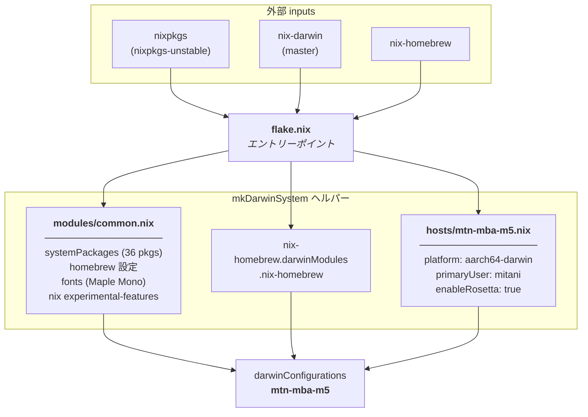

# nix-darwin 設定構造

## 構造のポイント

- **`flake.nix`** — `mkDarwinSystem` ヘルパーで3つのモジュールをまとめてホスト設定を生成
- **`modules/common.nix`** — どのホストにも共通するパッケージ・設定 (今後ホストが増えても再利用可能)
- **`hosts/mtn-mba-m5.nix`** — `mtn-mba-m5` 固有の設定 (platform / user / Rosetta)
- **`nix-homebrew` モジュール** — 外部 input から直接注入され、`common.nix` の `homebrew` 設定と連携
